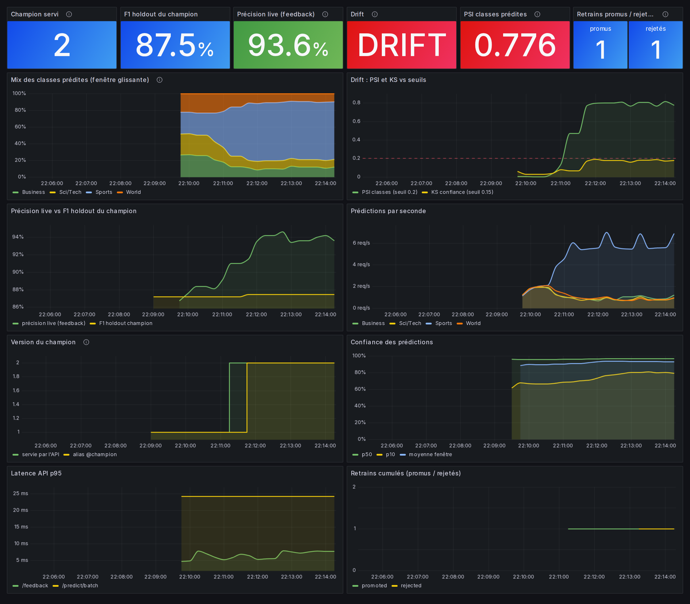
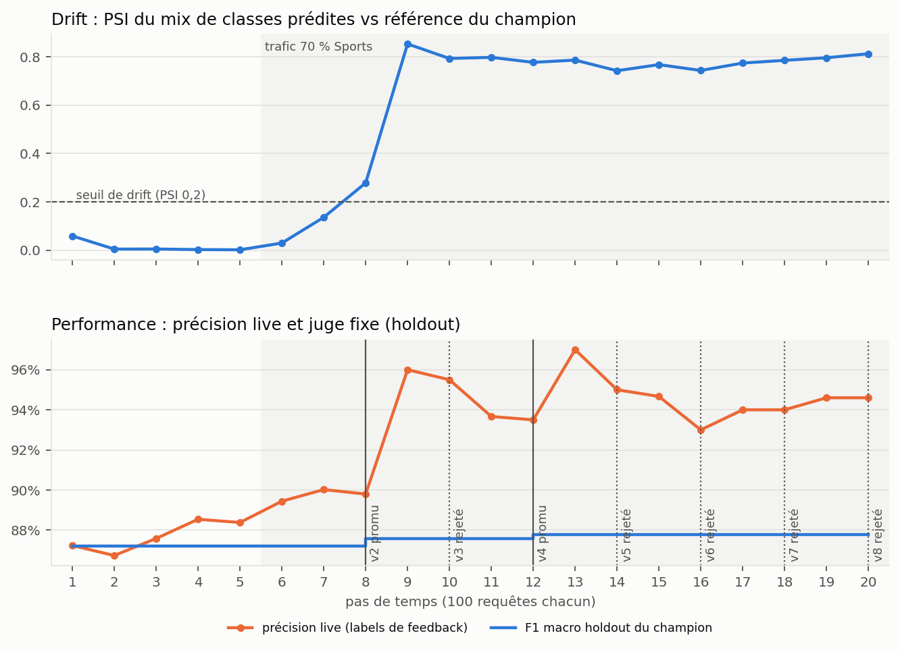
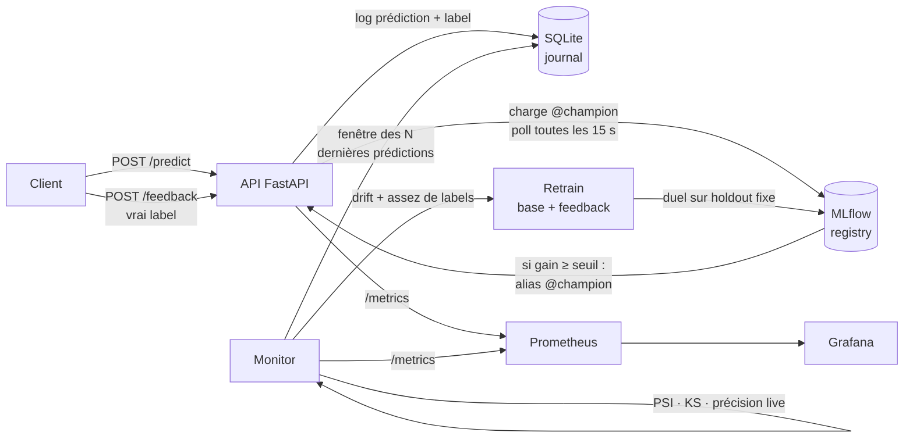

# Proths : une boucle MLOps complète, de l'entraînement au réentraînement automatique

[](https://github.com/Airohh/Proths/actions/workflows/ci.yml)


Un classifieur d'articles de presse (AG News, 4 classes) servi par une API, surveillé
en continu, et réentraîné tout seul quand le trafic change. Un nouveau modèle ne passe en
production **que s'il bat le modèle en place sur un jeu de test fixe**.

```
entraîner → servir → journaliser → recevoir les vrais labels → détecter le drift
    ↑                                                                   ↓
    └──── promouvoir si meilleur ←── comparer sur le holdout ←── réentraîner
```



*Capture réelle de la stack Docker : le trafic passe à 70 % d'articles Sports, le PSI
dépasse 0,2, le monitor réentraîne ; la v2 est promue, le candidat suivant est rejeté.*

## Résultats

**Choix du modèle** : même train (120 000 articles), même holdout (3 800), `make compare`.

| Modèle | Accuracy | F1 macro | Entraînement | Inférence |
|---|---|---|---|---|
| **Régression logistique (SGD)** · retenu | **0.923** | **0.923** | 23 s | 0,09 ms/doc |
| LinearSVC calibré | 0.923 | 0.923 | 28 s | 0,09 ms/doc |
| Complement Naive Bayes | 0.912 | 0.912 | 17 s | 0,09 ms/doc |
| Random Forest (`max_depth=10`, ancienne baseline) | 0.804 | 0.802 | 18 s | 0,10 ms/doc |

La première version du projet utilisait un Random Forest entraîné sur 4 000 articles
(F1 0,73). Sur du TF-IDF creux, un modèle linéaire est à la fois plus juste et plus rapide.
Détail par classe dans la [model card](MODEL_CARD.md).

**La boucle en action** : `make demo` rejoue le scénario hors Docker, sur les vraies données.



- Démarrage à froid : un champion v1 entraîné sur 5 000 articles (F1 holdout 0,872).
- Pas 6 : le trafic passe à 70 % Sports. Au pas 8, le PSI franchit 0,2 : drift détecté.
- Le monitor réentraîne sur *base + vrais labels du feedback*. Les candidats sont jugés
  sur le même holdout. Résultat : v2 et v4 promus, 5 candidats rejetés parce qu'ils ne
  gagnaient pas au moins +0,002 de F1.

> **Ce que montre le graphique du bas** : la précision live **monte** (87 % → 95 %)
> pendant le drift, sans que le modèle ait changé. La raison : Sports est la classe la plus
> facile. Une métrique calculée en production dépend du mix du trafic. C'est pour ça que
> la promotion se décide sur un holdout fixe, jamais sur la précision live.

## Architecture



| Composant | Rôle |
|---|---|
| `src/training/pipeline.py` | Un seul `Pipeline` sklearn : nettoyage → TF-IDF → classifieur |
| `src/training/train.py` | Entraîne un candidat, le compare au champion sur le holdout, promeut ou rejette |
| `src/inference/api.py` | `/predict`, `/predict/batch`, `/feedback`, `/model/reload`, `/metrics` |
| `src/inference/store.py` | Journal des prédictions et des labels (SQLite en mode WAL) |
| `src/monitoring/drift.py` | PSI et chi² sur les classes prédites, KS sur la confiance |
| `src/monitoring/monitor.py` | Boucle de surveillance, déclenchement du retrain, métriques Prometheus |
| `src/retraining/retrain.py` | Construit le jeu d'entraînement : base + vrais labels du feedback |

Plus de détails : [docs/architecture.md](docs/architecture.md).

## Choix techniques

**Un seul artefact, du texte brut à la prédiction.** Nettoyage, TF-IDF et modèle forment
un `Pipeline` loggé d'un bloc dans MLflow. L'API applique donc exactement le même
prétraitement que l'entraînement : pas de train/serve skew. Un modèle ne peut pas non plus
se retrouver servi avec le vocabulaire d'un autre. (C'étaient deux bugs de la v1 : le
vectorizer était un pickle à part, réécrit à chaque retrain.)

**Un juge fixe pour les promotions.** Le split test d'AG News est coupé en deux :
- `holdout` : sert uniquement à comparer champion et challenger, **dans le même run**,
  sur les mêmes lignes ;
- `stream` : joue le trafic de production.

Les deux moitiés sont disjointes : aucun label de feedback ne peut fuiter dans le juge.

**Réentraîner sur de vrais labels.** Le retrain utilise les labels renvoyés par
`/feedback` (annotateurs, corrections d'utilisateurs), jamais les prédictions du modèle.
Réentraîner sur ses propres prédictions ne ferait que renforcer ses erreurs.

**Un drift mesuré sans labels.**
- PSI sur la répartition des classes prédites (seuil 0,2, la règle usuelle) ;
- KS sur la distribution de la confiance ;
- chi² en information seulement : sur de gros volumes, sa p-value devient minuscule pour
  des écarts sans importance.

Chaque version du modèle embarque son profil de référence (`reference_profile.json`),
mesuré sur le holdout au moment de l'entraînement.

**Aliases MLflow plutôt que stages.** Les stages sont dépréciés depuis MLflow 2.9. L'API
sert `models:/news-classifier@champion` et vérifie l'alias périodiquement : chaque replica
se met à jour seul, même sans l'appel `POST /model/reload`.

**Un monitor sans état.** La date du dernier entraînement est lue dans MLflow. Pour éviter
de réentraîner en boucle, un retrain exige trois conditions :
- un signal (drift ou chute de précision) ;
- assez de nouveaux labels ;
- un cooldown écoulé.

## Lancer le projet

### Avec Docker (stack complète)

```bash
make seed        # télécharge AG News, entraîne le premier champion (TRAIN_SIZE=5000 pour la démo)
make up          # MLflow :5000 · API :8000/docs · Prometheus :9090 · Grafana :3000
make drift       # 500 requêtes à 70 % Sports + feedback → regarder Grafana
```

### En local

```bash
python -m venv .venv && source .venv/bin/activate
make install
make data        # data/processed/{train,holdout,stream}.csv
make train       # premier champion (F1 ≈ 0,923)
make api         # terminal 1
make monitor     # terminal 2
make drift       # terminal 3
```

```bash
curl -X POST localhost:8000/predict -H "Content-Type: application/json" \
     -d '{"text": "Oil prices fall as OPEC signals higher output"}'
# {"prediction_id": "3f2c…", "prediction": "Business", "confidence": 0.93, "model_version": "1", …}

curl -X POST localhost:8000/feedback -H "Content-Type: application/json" \
     -d '{"prediction_id": "3f2c…", "label": "Business"}'
```

### Qualité

```bash
make test        # 30 tests, 90 % de couverture, dont la boucle complète
make lint        # ruff
make demo        # scénario de la boucle → reports/demo.{json,png}
make compare     # comparaison des modèles → reports/model_comparison.md
```

La CI lance quatre jobs :
- le lint ;
- les tests, avec un seuil de couverture ;
- une *quality gate* : entraînement sur 30 000 vrais articles, échec si le F1 holdout
  passe sous 0,85 ;
- le build des images Docker.

## Limites connues et prochaines étapes

- **Le drift persiste après un retrain.** Si le mix du trafic change durablement, la
  référence (le holdout équilibré) ne correspond plus au trafic. Il faudrait rebaser la
  référence une fois le changement accepté, ou pondérer le holdout par le mix courant.
- **Le holdout est statique.** Avec le temps, il faudrait le rafraîchir à partir de labels
  récents, tout en gardant un sous-ensemble figé pour la comparabilité.
- **Pas de shadow ni de canary.** La promotion est immédiate. L'étape suivante serait de
  servir le challenger en parallèle et de comparer sa précision live avant la bascule.
- **Mono-machine.** Le journal SQLite partage un volume Docker entre l'API et le monitor.
  Au-delà, il faudrait Postgres ou un topic Kafka, avec un worker de monitoring séparé.
- **Pas d'authentification.** Grafana est en lecture anonyme : c'est une démo locale.

## Stack

scikit-learn · MLflow (tracking + registry) · FastAPI · SQLite · Prometheus · Grafana ·
Docker Compose · GitHub Actions · ruff · pytest

Licence [MIT](LICENSE).
